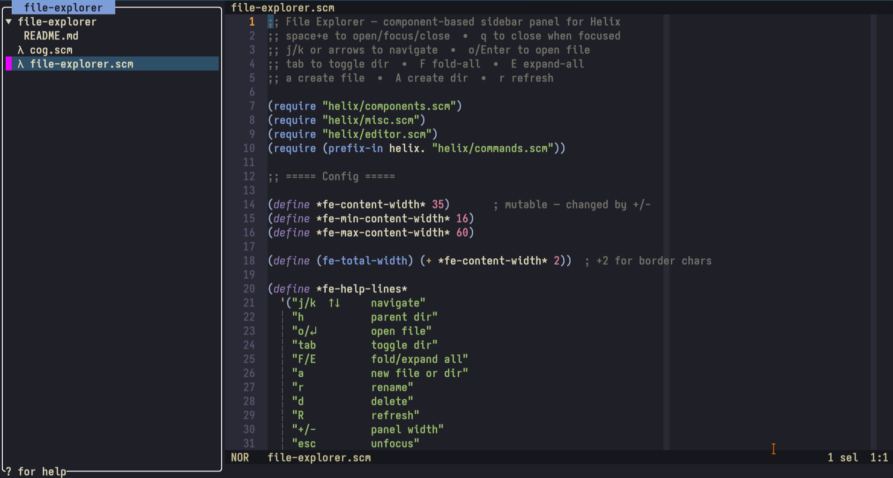

# Helix editor file-explorer plugin

A sidebar file explorer panel for the [Helix](https://helix-editor.com) editor, built with [Steel](https://github.com/mattwparas/steel) (the Scheme scripting layer embedded in Helix).

> This project was entirely developed with Claude Code.

---



## Features

- Sidebar panel that stays open while you edit — focus switches between the explorer and the editor independently
- Directories listed before files, sorted alphabetically
- Automatically reveals and highlights the currently open file when opening or refocusing the explorer
- Navigate with `j`/`k`, jump to parent with `h`, toggle directories with `Tab` or `o`
- Fold or expand the entire tree at once with `F` / `E`
- Create files or directories with a single prompt — just append `/` to the name for a directory
- Rename with a pre-filled prompt showing the current name
- Delete with a single-keypress confirmation (`y` / anything else)
- Refresh the tree with `R`
- Resizable panel width (`+` / `-`, range 16–60 columns)
- On-demand help overlay (`?`)

## Installation

This is a Steel cog for Helix. Copy the `file-explorer/` directory into your Steel cogs path (usually `~/.steel/cogs/`), then require it from your Helix Steel init file:

```scheme
(require "file-explorer/file-explorer.scm")
```

Bind the toggle command to a key in your `init.scm`:

```scheme
(require "file-explorer/file-explorer.scm")
(require "helix/keymaps.scm")
(keymap (global)
        (normal (space (e ":open-file-explorer"))))
```

## Key bindings

| Key | Action |
|-----|--------|
| `j` / `k` / `↑` / `↓` | Navigate up and down |
| `h` | Go to parent directory |
| `o` / `Enter` | Open file / toggle directory |
| `Tab` | Toggle directory expand/fold |
| `F` | Fold all directories |
| `E` | Expand all directories |
| `a` | New file or directory (end name with `/` for a dir) |
| `r` | Rename selected file or directory |
| `d` | Delete selected file or directory (press `y` to confirm) |
| `R` | Refresh the tree |
| `+` / `-` | Widen / narrow the panel |
| `Esc` | Unfocus explorer (return to editor, keep panel open) |
| `q` | Close the explorer |
| `?` | Show key bindings help |

## Usage notes

- Open/focus/close the explorer with your bound key (e.g. `Space+e`).
- When the explorer is open but unfocused, the editor works normally and the panel stays visible.
- Refocusing the explorer will reveal and highlight the file currently open in the editor.
- The panel width can be adjusted live with `+` and `-` (min 16, max 60 columns).

## Requirements

- Helix with Steel scripting enabled (the Steel modules are bundled with Helix itself)
